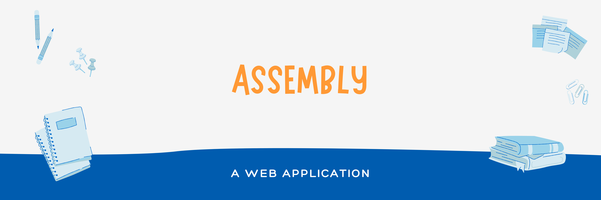

<h2> 📮 ASSEMBLY </h2>
The <a href="https://github.com/Ajaiqmar/ASSEMBLY">Assembly</a> 📮 Application is a Web application which was one of the earlier projects that I built. This application was built to increase the inter-college communication during the pandemic. In simple words, It is a place where the users can create a chat board.

<h2> 📱TECHNOLOGY STACK </h2>

